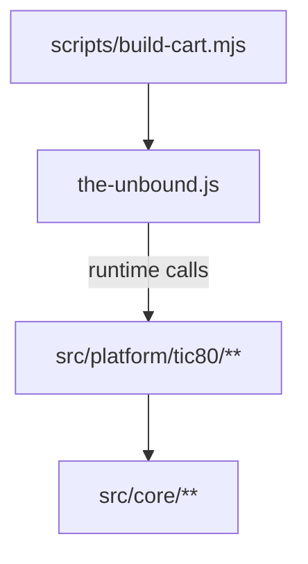

# The Unbound TypeScript + Build Design

## Context

**Prompt:** “TypeScript rewrite and build process.”

**Reasoning:** TIC-80 requires a single JavaScript cart with a global `TIC()` entrypoint and specific metadata comments. We want to author the game in multi-file TypeScript for maintainability, but still emit a single, committed `the-unbound.js` that runs when pasted into TIC-80 (and remains parse-safe on the TIC website).

---

## Overview

We will treat TypeScript as the **source of truth** and generate a single-file TIC-80 cart (`the-unbound.js`) via a build step:

- **Typecheck** with `tsc --noEmit` (esbuild does not typecheck).
- **Bundle** TS modules into one JS file with `esbuild`, outputting to repo root as `the-unbound.js`.
- **Commit** the built `the-unbound.js` so the repository is always runnable without requiring Node tooling.

### Cart output contract (critical)

The generated `the-unbound.js` must satisfy:

1. **Metadata header at the top**: The first lines must include the TIC-80 metadata block:
   - `// title: ...`
   - `// author: ...`
   - `// desc: ...`
   - `// script: js`
   - `// input: mouse`
2. **License header included**: Immediately after the metadata block, include a short license header (e.g. `SPDX-License-Identifier: MIT` and a pointer to `LICENSE`).
3. **Global `TIC()` entrypoint**: the bundle must define `TIC()` and register it on the global object (via `globalThis` when available) so TIC-80 can call it each frame.
4. **Metadata footer at EOF**: Repeat the *same* TIC-80 metadata block again as the final lines of the file. This is a guardrail for a known TIC website parser issue where later `desc:`-like tokens can be misinterpreted and override the cartridge metadata.
5. **No external runtime deps**: output is fully self-contained.

Implementation mechanism:
- Use esbuild `banner` for the metadata header + license header.
- Use esbuild `footer` for the repeated metadata block at EOF.

### Build output settings (pinned)

We will pin esbuild settings to avoid emitting module wrappers or runtime expectations TIC-80 can’t satisfy.

Requirements for the bundler step:

- **Entry point**: `src/platform/tic80/entry.ts`
- **Bundle**: enabled (single file output)
- **Format**: `iife` (self-executing bundle; no CommonJS/ESM loader semantics)
- **Target**: `es2020` (TIC-80 uses QuickJS; ES2020 syntax is acceptable and keeps output more readable)
  - If TIC-80 runtime rejects emitted syntax in practice, lower the target as needed (compatibility over elegance).
- **Minification**: off by default (keep diffs readable; avoid surprising TIC-80 edge cases)
- **Sourcemaps**: off by default (not useful in TIC-80 paste flow; reduces output size/noise)

These settings are part of the “cart output contract”; changes to them should be treated as compatibility-affecting.

### Build-time validation (metadata parser guardrail)

Because the TIC website parser can be confused by later `desc:`-like tokens, the build must include a **validation step** that fails fast if the output violates the contract.

At minimum, the validator must assert:

- The file **starts** with exactly the intended metadata block (in order).
- The file **ends** with the same metadata block (in order).
- The file contains **no additional** occurrences of the metadata keys (especially `desc:`) outside those two blocks.

Practical guidance:

- Prefer `description` over `desc` in code identifiers (object keys, variables) to reduce the chance of accidental triggers.
- Keep the metadata strings centralized so banner+footer are generated from a single source of truth in the build script.

### Developer workflow: watch mode (non-irrecoverable)

We want a smooth edit loop where temporary broken states (missing exports, half-applied refactors) do **not** require restarting the toolchain.

Design:

- **Bundling watch**: use esbuild’s watch mode.
  - If a module import is temporarily broken (e.g. “module X has no export Y”), esbuild reports the error but **keeps watching**.
  - When the export is added/fixed, esbuild rebuilds automatically and writes a new `the-unbound.js`.
- **Typecheck watch**: run `tsc -w` in parallel.
  - Type errors are reported continuously but do **not** block bundling unless they become bundle-time errors.

Validation behavior in watch:

- The metadata/footers validator runs after each successful rebuild.
- Validation failures should be reported as errors but **must not crash the watcher**; once the offending change is fixed, rebuild+validation recovers automatically.

---

## Architecture

We split the codebase into **portable core logic** and **platform adapters** so a future HTML build can replace rendering + input without rewriting game logic.

### Core (platform-agnostic)

- Location: `src/core/**`
- Rules:
  - Must not import from `src/platform/**`.
  - Must not call TIC-80 APIs (`spr`, `pix`, `mouse`, `print`, etc.).
  - Contains pure logic: state, reducer, world generation, formatting helpers.

### Platform adapters (TIC-80 today; HTML later)

- Location: `src/platform/tic80/**`
- Contents:
  - **Input adapter**: converts TIC-80 `mouse()` samples into core `Action`s.
  - **Renderer**: reads core `State` and renders via TIC-80 APIs.
  - **Entrypoint glue**: holds the mutable `state`, calls reducer + renderer, exports `TIC()` and registers it globally.

This preserves a clean dependency flow:

---

## Trade-offs considered

- **Single-file TS without bundling**: simplest, but loses module boundaries and becomes hard to maintain.
- **Rollup / webpack**: capable, but heavier config and slower iteration for this repo’s needs.
- **esbuild + tsc** (chosen): minimal config, fast builds, one-file output, keep TS strictness via separate typecheck.

---

## Supply chain / public-repo hygiene

Adding Node tooling introduces dependency and script risk. We will keep this minimal and explicit:

- **Dependencies**: keep direct devDependencies minimal and intentional.
  - Required: `typescript`, `esbuild`
  - Tests: `vitest`
  - TIC-80 typings: `tic80-typescript` (devDependency) — used only as a source of TIC-80 API `.d.ts` declarations; we are not adopting its whole build workflow.
    - Note: its declarations live under `tocopy/tic.d.ts` and aren’t exposed as a package-level `types` entry, so we include that file explicitly in `tsconfig.json`.
- **Lockfile**: commit the lockfile (e.g. `package-lock.json`) so installs are reproducible.
- **No postinstall hooks**: avoid adding packages that rely on install-time scripts; keep `scripts/` limited to deterministic build/validation tasks that do not embed machine-local paths into output.

## Compatibility / risks

- **JavaScript target support**: TIC-80’s JS runtime must support the emitted syntax. We will set conservative build targets (e.g. `es2017`) and validate by running the output in TIC-80.
- **TIC website metadata parser**: we explicitly repeat the metadata block at EOF and avoid introducing accidental `desc:`-like tokens in code (prefer `description` over `desc` in object keys).
- **Bundle determinism**: avoid injecting timestamps/paths into banner/footer so `the-unbound.js` diffs are stable.
- **Portability drift**: without guardrails, platform code can leak into core. We’ll enforce the boundary (below).

## Portability boundary (enforcement)

We will enforce the “core vs platform” split with both structure and checks:

- **Rule**: `src/core/**` must not import from `src/platform/**`.
- **Rule**: `src/core/**` must not call TIC-80 APIs (`spr`, `pix`, `mouse`, `print`, `rect`, `rectb`, `cls`, etc.).

Enforcement approach (lightweight):

- Add a small script (e.g. `scripts/check-portability.mjs`) that scans `src/core/**` for:
  - import specifiers containing `/platform/`
  - obvious TIC-80 API call sites (heuristic regex for the API names)
- Run this check as part of `npm run build` (before bundling).

---

## Acceptance Criteria

| # | Scenario | Expected result |
|---:|---|---|
| 1 | `npm run build` | Typecheck passes and writes root `the-unbound.js` |
| 2 | Paste `the-unbound.js` into TIC-80 and run | Game renders and is playable |
| 3 | Build validation | Build fails if metadata contract is violated (header/EOF mismatch or extra `desc:`-like tokens) |
| 4 | Inspect built file | Contains metadata at top **and** repeated at EOF; contains license header; exposes global `TIC()` |

**E2E test scope:** Manual (TIC-80 run) + optional in-cart `RUN_TESTS=true` harness.

## E2E Decision

- **Asked:** yes
- **User decision:** no (not building an HTML target now)
- **Reason:** This phase focuses on rewrite/build plumbing and preserving future portability boundaries.

