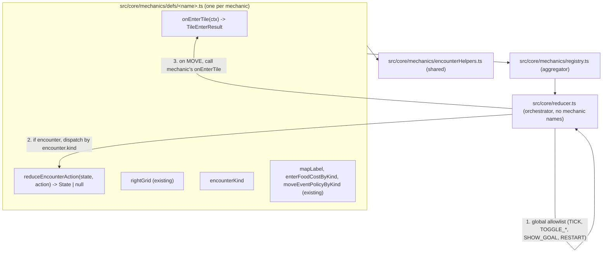
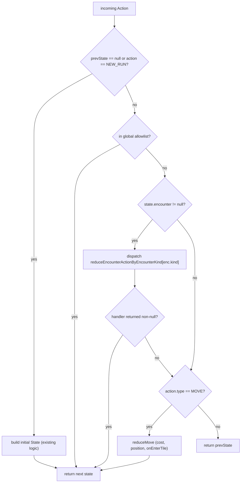

# Mechanics-owned Encounters — Design

## Context

**Prompt:** `/start see docs/refactor-mechanics-encounters-worldgen.md … main idea is to create a system where adding a new mechanic is largely centralised in the mechanics def file. spriteIds.ts and lore.ts are intentionally breaking this rule … reduce duplication, introduce reusable functions instead of copy-pasting them almost verbatim`

**Inputs:**

- `docs/refactor-mechanics-encounters-worldgen.md` — Stage A (encounter action handling) and Stage B (worldgen as plugins). This document supersedes that doc's Stage A only; Stage B remains an active proposal and is out of scope here.
- `docs/the-unbound-learnings.md` — OCP mindset, single source of truth, mechanics live in mechanic modules, "from scratch" refactor test.
- Current `src/core/mechanics/` registry already covers `onEnter`, `startEncounter`, `rightGrid`, `mapLabel`, `enterFoodCostByKind`, `moveEventPolicyByKind`. Stage A and the additional reducer leaks below extend that surface.

**Brainstorm decisions (recorded):**

- Encounter dispatch shape: per-`encounter.kind` registry, with a small **global-action allowlist** (`TICK`, `TOGGLE_MAP`, `TOGGLE_MINIMAP`, `SHOW_GOAL`, `RESTART`, `NEW_RUN`) handled **before** encounter dispatch. Not strict-mode (mechanics don't need to forward globals); not per-action-type registry.
- `onEnter` + `startEncounter` + bypass logic + cell mutations **collapse into a single `onEnterTile`** hook on `MechanicDef` (the "tile decides whatever it wants" framing). Mechanic owns its own `gridTransition` enter-anim emission via the result.
- Sprite IDs **stay central** in `src/core/spriteIds.ts` (sheet-reshuffle ergonomics).
- Tuning constants and per-mechanic action constants **stay in** `src/core/constants.ts` for this PR (trivial later move; the reducer is the pain point).
- One PR end-to-end. Small RNG-stream or animation-timing tweaks pre-approved if they buy elegance.
- Stage B (worldgen plugins), `signpost.ts` POI ranking rework, and `Action`/`Encounter` union derivation are **out of scope**.

---

## Goal

Make `src/core/reducer.ts` mechanic-name-free. After this refactor, adding a new modal-encounter mechanic is achieved by editing one file under `src/core/mechanics/defs/` (plus deliberate exceptions: `spriteIds.ts`, `lore.ts`, and the inevitable additions in `types.ts`/`constants.ts`).

The "what does this mechanic do?" behavior — including its tile-enter rules, encounter open/close, encounter action reduction, right-grid UI, animations, and any cell mutations — concentrates in the def file. The reducer becomes a thin orchestrator.

---

## Identified mechanic-name leaks (the things being killed)

In [src/core/reducer.ts](src/core/reducer.ts):

1. **Explicit encounter-reducer chain** (lines 594–604): `reduceCampAction → reduceFarmAction → reduceLocksmithAction → reduceTownAction`.
2. **`startEncounter` post-conditions** (lines 325–332): per-mechanic `didStartCamp/Town/Farm/Locksmith` booleans.
3. **Locksmith bronze-key bypass** (line 325): `if (destKind === 'locksmith' && nextResources.hasBronzeKey) nextEncounter = null`.
4. **Henge cooldown special case** (line 355): `if (destKind === 'henge') { … nextReadyStep … }` after combat is spawned from a move event.
5. **Per-modal grid-transition emission** (lines 449–464): five `if (didStartX) enqueueGridTransition({ to: 'X' })` blocks.
6. **Combat encounter actions** (lines 606–789): ~140 lines of `ACTION_FIGHT`/`ACTION_RETURN` reducer logic in the main reducer.
7. **Move-event `hazardSource` switch** in [src/core/mechanics/moveEvents.ts](src/core/mechanics/moveEvents.ts) (lines 18–21, 36, 43): `kind === 'henge'` cooldown lookup and `'woods' | 'swamp' | 'mountain' | 'henge'` allowlist.

In `src/core/{camp,town,farmEncounter,locksmithEncounter}.ts`:

8. **Cross-encounter copy-paste**: `setMessage(line)`, `noGold()`, `leaveEncounter` flow, "spend-and-animate gold/food/troops" boilerplate. 4–5 near-verbatim copies each.

---

## Target architecture



### Reducer's new dispatch flow



**Note:** `NEW_RUN` (and the null-`prevState` bootstrap path it triggers) stays **above** the global allowlist and encounter dispatch, conceptually unchanged from today. It's a special entrypoint that builds initial `State`, not a reducer step.

### `MechanicDef` surface (additions)

In [src/core/mechanics/types.ts](src/core/mechanics/types.ts):

```ts
// As-shipped (post-Slice-6 + external-review tightening). Earlier drafts of this section
// proposed a 3-arm AnimSpec and a wider TileEnterCtx (prevPos/dx/dy/prevResources/ui) — those
// were narrowed during implementation when handlers proved they don't need them.
export type AnimSpec = { kind: 'gridTransition'; from: GridFromKind; to: GridToKind; afterFrames?: number }

export type TileEnterCtx = {
  cell: Cell
  world: World
  pos: Vec2
  stepCount: number
  resources: Resources       // post food-cost, pre handler
}

export type TileEnterResult = {
  world?: World                          // omit = unchanged
  resources?: Resources                  // omit = unchanged (reducer foodCarry-clamps)
  encounter?: Encounter | null           // omit = unchanged; null = explicitly clear (rare)
  message?: string                       // omit = default-terrain lore for the cell kind
  hasWon?: boolean
  knowsPosition?: boolean                // truth-only hint; OR'd into prev. Teleport clears.
  teleportTo?: Vec2 | null               // for 'lost' events; reducer applies after `pos`
  enterAnims?: readonly AnimSpec[]       // grid transitions; reducer enqueues at startFrame + MOVE_SLIDE_FRAMES
}

export type ReduceEncounterAction = (state: State, action: Action) => State | null

export type MechanicDef = {
  // existing: id, kinds, mapLabel, enterFoodCostByKind, moveEventPolicyByKind, rightGrid

  onEnterTile?: (ctx: TileEnterCtx) => TileEnterResult

  // Single field replaces both `rightGridEncounterKind` (today) and the new dispatch key.
  // A mechanic owns at most one encounter kind; that kind drives both right-grid lookup
  // and reduceEncounterAction dispatch.
  encounterKind?: EncounterKind
  reduceEncounterAction?: ReduceEncounterAction
}
```

The old `onEnter: TileEnterHandler`, `startEncounter: StartEncounterFn`, and `rightGridEncounterKind` fields are **removed** in the same change. `rightGridEncounterKind` is replaced by the unified `encounterKind`. No compatibility shim — the test suite is the safety net.

**Default tile-enter behavior:** If a mechanic has no `onEnterTile`, the reducer falls back to a built-in default that returns `{ message: r.perMoveLine(terrainLoreLinesForKind(cell.kind)) }` (preserving today's `onEnterDefaultTerrain`).

**Field semantics for omitted fields:** `world`/`resources` omit = unchanged; `encounter` omit = unchanged (NOT cleared — that's a common footgun the registry validates against); `message` omit = default-terrain lore.

### Concrete examples (illustrative; final form decided in implementation)

**Locksmith bronze-key bypass** (kills [src/core/reducer.ts](src/core/reducer.ts) line 325):

```ts
const onEnterLocksmith: OnEnterTile = (ctx) => {
  const r = RNG.createTileRandom(...)
  if (ctx.resources.hasBronzeKey) {
    return { message: `${LOCKSMITH_NAME}\n${r.perMoveLine(LOCKSMITH_VISITED_LINES)}` }
  }
  const message = `${LOCKSMITH_NAME}\n${r.stableLine(LOCKSMITH_ENTER_LINES)}`
  return {
    message,
    encounter: { kind: 'locksmith', sourceKind: 'locksmith', sourceCellId: cellIdFor(ctx), restoreMessage: message },
    enterAnims: [{ kind: 'gridTransition', from: 'overworld', to: 'locksmith', afterFrames: MOVE_SLIDE_FRAMES }],
  }
}
```

**Henge ambush + cooldown** (kills [src/core/reducer.ts](src/core/reducer.ts) line 355):

The henge mechanic's `onEnterTile` rolls the move event itself via the `moveEvents` helper, mutates the henge cell to set `nextReadyStep` when an ambush fires, spawns the combat encounter, and returns the appropriate enter-anims.

**Combat actions** (kills [src/core/reducer.ts](src/core/reducer.ts) lines 606–789):

The ~140 lines of `ACTION_FIGHT` / `ACTION_RETURN` logic move verbatim into `reduceEncounterAction` on [src/core/mechanics/defs/combat.ts](src/core/mechanics/defs/combat.ts) with `encounterKind: 'combat'`. Action constants `ACTION_FIGHT`/`ACTION_RETURN` stay in `constants.ts` (per scope decision).

### Reducer's shrunk encounter dispatch

```ts
const enc = prevState.encounter
if (enc) {
  const handler = reduceEncounterActionByEncounterKind[enc.kind]
  if (handler) {
    const next = handler(prevState, action)
    if (next != null) return next
  }
}
if (action.type === ACTION_MOVE) return reduceMove(prevState, action.dx, action.dy)
return prevState
```

`reduceMove` shrinks similarly: compute food cost, call `getOnEnterTileHandler(cell.kind)(ctx)`, splice the result into state, append `enterAnims`. The seven `if (didStartX) enqueueGridTransition(...)` blocks vanish.

### Shared encounter helpers

A new [src/core/mechanics/encounterHelpers.ts](src/core/mechanics/encounterHelpers.ts) collects the cross-encounter copy-paste:

- `encounterPrefix(cell)` — returns e.g. `"Big Henge Henge"` from a named cell
- `appendMessage(state, prefix, line)` — `ui.message = prefix + '\n' + line`
- `noGoldResponse(state, prefix, cellId)` — emits `TOWN_NO_GOLD_LINES`
- `leaveEncounter(state, gridFromKind)` — clears encounter, enqueues gridTransition back to overworld, restores `restoreMessage`
- `spendAndAnimate(state, deltas, message)` — applies resource deltas and enqueues delta anims
- `applyEnterAnims(ui, anims, startFrame)` — converts `AnimSpec[]` from a mechanic's `enterAnims` into enqueued anims (used by the main reducer)

---

## Structural acceptance criteria

These are the non-behavioral, code-shape outcomes that this refactor must achieve:

| ID | Criterion | Verification |
| -- | --------- | ------------ |
| C1 | [src/core/reducer.ts](src/core/reducer.ts) contains zero string literals from the **mechanic-kind banlist**: `'camp'`, `'town'`, `'farm'`, `'locksmith'`, `'henge'`, `'gate'`, `'gateOpen'`, `'signpost'`, `'fishingLake'`, `'rainbowEnd'`, `'combat'`, `'woods'`, `'swamp'`, `'mountain'`. (Note: this is the per-mechanic banlist, not "zero cell-kind strings" — generic strings like `'overworld'` or `'blank'` for grid transitions remain acceptable since they describe modal *layouts*, not mechanics.) | `rg "'(camp\|town\|farm\|locksmith\|henge\|gate\|gateOpen\|signpost\|fishingLake\|rainbowEnd\|combat\|woods\|swamp\|mountain)'" src/core/reducer.ts` returns nothing. |
| C2 | The four files `src/core/{camp,town,farmEncounter,locksmithEncounter}.ts` are deleted; **all** consumers (tests AND non-test code such as [src/platform/tic80/render.ts](src/platform/tic80/render.ts)) updated to import from the new def-file paths. | `ls` returns no such files; `rg "core/(camp\|town\|farmEncounter\|locksmithEncounter)" src/ tests/` returns nothing. |
| C3 | [src/core/mechanics/encounterHelpers.ts](src/core/mechanics/encounterHelpers.ts) exists and is imported by at least 3 mechanic defs. | `rg "from '\.\./encounterHelpers'" src/core/mechanics/defs/` returns ≥3 matches. |
| C4 | `MechanicDef.onEnterTile` is the only tile-enter hook; `MechanicDef.onEnter`, `MechanicDef.startEncounter`, and `MechanicDef.rightGridEncounterKind` no longer exist (the latter is merged into `encounterKind`). | grep over `src/core/mechanics/types.ts`. |
| C5 | `MechanicDef.reduceEncounterAction` exists and is set on at least 5 defs (camp, town, farm, locksmith, combat). | grep over `src/core/mechanics/defs/`. |
| C6 | The reducer's encounter dispatch is a single `reduceEncounterActionByEncounterKind[enc.kind](...)` call, not a chain of `reduceXAction` imports. | code review on the resulting reducer. |
| C7 | [src/core/mechanics/moveEvents.ts](src/core/mechanics/moveEvents.ts) contains zero hardcoded mechanic kind names (no `kind === 'henge'`, no `'woods' | 'swamp' | ...` switches). | `rg "'(henge\|woods\|swamp\|mountain)'" src/core/mechanics/moveEvents.ts` returns nothing. |
| C8 | Adding a hypothetical new modal mechanic ("tavern") would touch only: `src/core/mechanics/defs/tavern.ts` (new), `src/core/mechanics/index.ts` (one-line array entry), `src/core/types.ts` (additive `CellKind` + `Encounter` + `Action` union entries — out-of-scope is *automated derivation*, not additive edits), `src/core/constants.ts` (action consts + tuning), `src/core/spriteIds.ts` (sprites), `src/core/lore.ts` (text). **No edits to `reducer.ts`, no edits to other defs, no edits to platform renderers (since they consume mechanic defs through the registry, not by direct import).** | thought experiment during code review; mentioned in PR description. |

## Behavioral acceptance criteria

| ID | Spec | Verification |
| -- | ---- | ------------ |
| B1 | All existing tests pass with no behavior change beyond pre-approved minor RNG-stream or animation-timing tweaks made deliberately for elegance. **Test source diffs are mostly import-path updates**, with two known small categories of mechanical change allowed: (a) `rollMoveEvent` call-site shape change in [tests/core/tileEvents.test.ts](tests/core/tileEvents.test.ts) and [tests/core/tileEvents.scout.test.ts](tests/core/tileEvents.scout.test.ts) — see the **`MoveEvent.source` decision** below (result-shape assertions remain unchanged); (b) any test reaching into a now-deleted module's internals migrates to the new def file. Any deliberate behavior tweak is called out in the PR description. | `npm test` green. |
| B2 | TypeScript build succeeds with zero errors. | `npm run build` (or equivalent) green. |
| B3 | Manual smoke test: a fresh seed plays through bronze key, henge fight, town purchase, camp search, gate opening. | Manual playthrough during review. |
| B4 | Local CI (`/test-ci`) green if `.github/workflows/` exists. | `act` run during the workflow's CI gate. |

### `MoveEvent.source` decision

Today's `rollMoveEvent` returns `{kind: 'fight' | 'lost', source: 'woods' | 'mountain' | 'swamp' | 'henge'}`. The `source` field is **not read by the reducer** (only `kind` is). It is asserted by ~10 lines across [tests/core/tileEvents.test.ts](tests/core/tileEvents.test.ts) and [tests/core/tileEvents.scout.test.ts](tests/core/tileEvents.scout.test.ts).

**Decision:** Keep `source` on the result; have the **caller pass it as a parameter** instead of the helper deriving it from `cell.kind`. Rationale:

1. Purification of `moveEvents.ts` requires removing the internal switch over kinds (`'woods' | 'mountain' | ...`). After purification the helper has no idea what kind of cell it is — `policy` and `source` both come from the caller.
2. Keeping `source` on the result preserves test result-shape assertions (the ~10 lines stay green); only the test call-site shape changes (`{cell, ...}` → `{policy, source, ...}`).
3. The alternative — dropping `source` entirely — would force test assertion rewrites without freeing the helper from any extra work (the caller would still pass the same data, just one fewer field).

**Test diff scope after this decision:** call-site shape changes (`cell: {kind: 'woods'}` → `policy: woodsPolicy, source: 'woods'`), unchanged result-shape assertions. A handful of lines per test file, mechanical.

---

## Files in scope

**New files:**

- [src/core/mechanics/encounterHelpers.ts](src/core/mechanics/encounterHelpers.ts)

**Heavy changes:**

- [src/core/mechanics/types.ts](src/core/mechanics/types.ts) — replace `TileEnterHandler`/`StartEncounterFn` with `onEnterTile`/`TileEnterResult`/`AnimSpec`/`ReduceEncounterAction`.
- [src/core/mechanics/registry.ts](src/core/mechanics/registry.ts) — `MechanicIndex` gains `onEnterTileByKind` and `reduceEncounterActionByEncounterKind`; validates one owner per encounter kind; drops `onEnterByKind`/`startEncounterByKind`.
- [src/core/mechanics/onEnter.ts](src/core/mechanics/onEnter.ts) — replaced/folded into `getOnEnterTileHandler` next to the registry.
- [src/core/mechanics/moveEvents.ts](src/core/mechanics/moveEvents.ts) — purified into a generic helper.
- [src/core/reducer.ts](src/core/reducer.ts) — major shrink. Global allowlist → encounter dispatch → move/onEnterTile.
- [src/core/mechanics/defs/camp.ts](src/core/mechanics/defs/camp.ts) — absorbs all of [src/core/camp.ts](src/core/camp.ts).
- [src/core/mechanics/defs/town.ts](src/core/mechanics/defs/town.ts) — absorbs all of [src/core/town.ts](src/core/town.ts).
- [src/core/mechanics/defs/farm.ts](src/core/mechanics/defs/farm.ts) — absorbs all of [src/core/farmEncounter.ts](src/core/farmEncounter.ts).
- [src/core/mechanics/defs/locksmith.ts](src/core/mechanics/defs/locksmith.ts) — absorbs all of [src/core/locksmithEncounter.ts](src/core/locksmithEncounter.ts); `onEnterTile` returns no encounter when `hasBronzeKey`.
- [src/core/mechanics/defs/combat.ts](src/core/mechanics/defs/combat.ts) — absorbs `ACTION_FIGHT`/`ACTION_RETURN` from [src/core/reducer.ts](src/core/reducer.ts).
- [src/core/mechanics/defs/henge.ts](src/core/mechanics/defs/henge.ts) — `onEnterTile` rolls ambush + sets cooldown.
- [src/core/mechanics/defs/terrainHazards.ts](src/core/mechanics/defs/terrainHazards.ts) — `onEnterTile` rolls woods/swamp/mountain ambushes and lost-teleports.

**Light changes:**

- [src/core/mechanics/defs/signpost.ts](src/core/mechanics/defs/signpost.ts), [src/core/mechanics/defs/gate.ts](src/core/mechanics/defs/gate.ts), [src/core/mechanics/defs/fishingLake.ts](src/core/mechanics/defs/fishingLake.ts), [src/core/mechanics/defs/rainbowEnd.ts](src/core/mechanics/defs/rainbowEnd.ts) — convert `onEnter` → `onEnterTile`. Mostly a rename + ctx shape adjustment; existing logic preserved.
- [src/platform/tic80/render.ts](src/platform/tic80/render.ts) — one-line import-path update: `import { computeCampPreviewModel } from '../../core/camp'` becomes `from '../../core/mechanics/defs/camp'`. (Identified during the design audit; spot-check `rg "core/(camp\|town\|farmEncounter\|locksmithEncounter)" src/` before opening the PR to catch any other consumers.)

**Deleted files:**

- [src/core/camp.ts](src/core/camp.ts)
- [src/core/town.ts](src/core/town.ts)
- [src/core/farmEncounter.ts](src/core/farmEncounter.ts)
- [src/core/locksmithEncounter.ts](src/core/locksmithEncounter.ts)
- [src/core/mechanics/onEnter.ts](src/core/mechanics/onEnter.ts) (folded into `registry.ts` neighborhood)

**Untouched (deliberately):**

- [src/core/spriteIds.ts](src/core/spriteIds.ts), [src/core/lore.ts](src/core/lore.ts), [src/core/constants.ts](src/core/constants.ts) — deliberate exceptions.
- [src/core/types.ts](src/core/types.ts) — left alone; `Action`/`Encounter` union derivation is a follow-up.
- [src/core/world.ts](src/core/world.ts) — Stage B, deferred.
- [src/core/rightGrid.ts](src/core/rightGrid.ts), [src/core/combat.ts](src/core/combat.ts), [src/core/teleport.ts](src/core/teleport.ts), [src/core/cells.ts](src/core/cells.ts), [src/core/foodCarry.ts](src/core/foodCarry.ts), [src/core/uiAnim.ts](src/core/uiAnim.ts), [src/core/rng.ts](src/core/rng.ts), [src/core/math.ts](src/core/math.ts) — pure utility subsystems; unchanged.
- All 30 tests under [tests/core/](tests/core/) — kept unchanged in behavior. Diffs limited to import-path updates.

---

## Options considered

### Encounter dispatch shape

| Option | Pros | Cons | Verdict |
| ------ | ---- | ---- | ------- |
| A. Dispatch by `encounter.kind`, return `null` = fall through to global handlers | matches proposal doc; small diff; trivial mental model | `null` (didn't handle) vs `prevState` (handled, no-op) ambiguity | rejected — footgun |
| B. Strict: encounter mechanic owns ALL actions while encounter is open | airtight contract | every mechanic must forward TICK / TOGGLE_MAP / etc. — high regression risk | rejected |
| C. Per-action-type registry, no `encounter.kind` in dispatch | most decoupled | mechanic still validates "we're in my encounter" inside every handler; loses framing | rejected |
| **D. A + small global-action allowlist handled BEFORE encounter dispatch** | removes the A-vs-B ambiguity; mechanic only thinks about its own actions; "global allowlist" is exactly the central knowledge that *should* stay central | one extra small list to maintain — but it lists what's truly global, not what's mechanic-specific | **chosen** |

### `onEnter` + `startEncounter` unification

| Scope | Description | Verdict |
| ----- | ----------- | ------- |
| 1 (small) | Keep `onEnter`/`startEncounter` split; add `shouldStartEncounter` predicate + `onCombatTriggered` post-hook | rejected — still leaks mechanic names to the reducer |
| 2 (medium) | Collapse into `onEnterTile`; mechanic owns bypass + cell mutations; reducer keeps `gridTransitionKey` metadata per def | rejected — `gridTransitionKey` is still a mechanic-name leak |
| **3 (full)** | Scope 2 + mechanic owns `gridTransition` enqueueing via `enterAnims` | **chosen** — fully achieves "no mechanic names in reducer" |

### Sprite IDs location

| Option | Verdict |
| ------ | ------- |
| Move into defs | rejected — sprite reshuffles want one-file grep |
| Hybrid (global layout central, decorative sprites in defs) | rejected — tracking the boundary adds cognitive load |
| **Keep central in `spriteIds.ts`** | **chosen** — matches user's original carve-out |

### Tuning constants location

| Option | Verdict |
| ------ | ------- |
| Move per-mechanic tuning + action constants into defs | rejected for this PR — easy follow-up; reducer is the actual pain point |
| **Keep central in `constants.ts`** | **chosen** for this PR |

### Incrementality

| Option | Verdict |
| ------ | ------- |
| Mechanic-by-mechanic PRs (camp, then town, then farm, …) | rejected — small blast radius but lots of in-flight churn |
| Two PRs (Stage A core, then registration consolidation) | rejected — registration consolidation is out of scope here |
| **One PR end-to-end** | **chosen** — diffs are mechanical once the new types land |

---

## Risk register

| ID | Risk | Mitigation |
| -- | ---- | ---------- |
| R1 | Import cycles between defs and registry/helpers | Strict module direction: `reducer → mechanics/index → defs/* → encounterHelpers + utility subsystems`. No back-edges. `encounterHelpers.ts` must not import `MECHANIC_INDEX`. |
| R2 | Combat reducer's RNG-stream consumption order changes | Move `ACTION_FIGHT`/`ACTION_RETURN` verbatim with the same `RNG.createStreamRandom(nextWorld.rngState)` ordering. [tests/core/combat.reducer.test.ts](tests/core/combat.reducer.test.ts) is the regression net. |
| R3 | Henge cooldown timing drifts | Today the cooldown is set inside `reducer.reduceMove` immediately after the combat encounter is created. Moving into `henge.onEnterTile` runs at the same logical point with the same `nextStepCount + HENGE_COOLDOWN_MOVES` value. [tests/core/v0.1-lost.acceptance.test.ts](tests/core/v0.1-lost.acceptance.test.ts) and [tests/core/tileEvents.test.ts](tests/core/tileEvents.test.ts) cover this. |
| R4 | Locksmith bypass interaction with grid transition | Today the bypass returns from the encounter check before any modal-transition anim is enqueued. New `onEnterTile` returns no `enterAnims` for the bypass case — same observable behavior. [tests/core/v0.0.9-key.acceptance.test.ts](tests/core/v0.0.9-key.acceptance.test.ts) is the regression net. |
| R5 | Move-event RNG keying drifts | `rollMoveEvent` keys by `{seed, stepCount, cellId}`. The helper signature stays unchanged; only call sites move. [tests/core/tileEvents.test.ts](tests/core/tileEvents.test.ts) and [tests/core/tileEvents.scout.test.ts](tests/core/tileEvents.scout.test.ts) are the regression net. |
| R6 | Tests import `reduceCampAction` etc. from `src/core/camp` and similar | Either re-export from the def file or update test imports. Decide during implementation; both are mechanical. Default: update test imports (one source of truth). |
| R7 | Pre-approved tweaks slip into unintended drift | Any deliberate behavior tweak is called out in the PR description. If a test breaks unexpectedly, fix the code, not the test. |
| R8 | Import cycles via the registry. `MECHANIC_INDEX` is built from def imports; a def or helper that imports `MECHANIC_INDEX` (or anything that transitively re-imports defs) creates a cycle. | Strict dependency direction: `reducer.ts` → `mechanics/index.ts` → `defs/*` → `encounterHelpers.ts` + utility subsystems (`cells`, `rng`, `uiAnim`, `lore`, `constants`). `encounterHelpers.ts` MUST NOT import `MECHANIC_INDEX`. Add a quick CI-time check or madge run if cycles become a recurring problem. |

---

## Out of scope

- **Stage B (worldgen as plugins).** Remains as proposed in [docs/refactor-mechanics-encounters-worldgen.md](docs/refactor-mechanics-encounters-worldgen.md). To be revisited after this lands; the existing proposal doc will be rewritten with whatever lessons we learn here.
- **`signpost.ts` POI ranking rework.** The central rank-by-PoI-kind list in [src/core/signpost.ts](src/core/signpost.ts) stays for now.
- **`Action` / `Encounter` union derivation.** [src/core/types.ts](src/core/types.ts) keeps its hand-maintained unions. Folding them into per-def declarations is a separate, future TypeScript exercise.
- **Moving per-mechanic action and tuning constants into defs.** Easy follow-up; user explicitly deferred.
- **Moving sprite IDs into defs.** Explicit user decision: the central file wins for sheet-reshuffle ergonomics.

---

## After this design

Per the [start workflow](../../.cursor/plugins/cache/the-armoury/armoury-resources/skills/start/SKILL.md), the gates are:

1. `/audit design` on this document.
2. `/plan` produces (or refines) the implementation plan: [2026-05-05-mechanics-owned-encounters-plan.md](2026-05-05-mechanics-owned-encounters-plan.md).
3. `/audit plan`.
4. `/execute` (or `/use-subagents`).
5. `/run-dev-loop` → `/deslop` (prompt) → `/review` → `/test-ci` → `/commit` → `/finish` → `/update-docs`.

Each gate requires explicit user approval. `/update-docs` is where [docs/refactor-mechanics-encounters-worldgen.md](docs/refactor-mechanics-encounters-worldgen.md) gets pruned to Stage B only (with Stage B rewritten knowing what we learned implementing Stage A).
